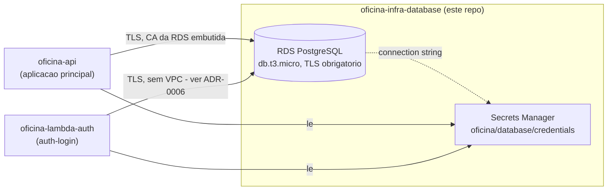

# oficina-infra-database

Infraestrutura do banco de dados gerenciado (via Terraform) do Tech Challenge Fase 3 (POSTECH). Parte do split de repositórios descrito em [ADR-0005](https://github.com/Williamnasci/oficina-api/blob/main/docs/adr/0005-split-de-repositorios.md), no repositório principal [`oficina-api`](https://github.com/Williamnasci/oficina-api).

## Propósito

Provisiona, via Terraform, a instância **Amazon RDS PostgreSQL** (`db.t3.micro`, single-AZ) usada tanto pela aplicação principal (`oficina-api`) quanto pela Lambda de autenticação (`oficina-lambda-auth`) — mesma base de dados, sem duplicação de dados de cliente.

Justificativa completa da escolha do motor/instância em [RFC-0002](https://github.com/Williamnasci/oficina-api/blob/main/docs/rfc/0002-escolha-do-banco-de-dados-gerenciado.md). Diagrama ER e explicação dos relacionamentos em [database-er.md](https://github.com/Williamnasci/oficina-api/blob/main/docs/database-er.md).

## Tecnologias

- Terraform
- Amazon RDS (PostgreSQL)
- AWS Secrets Manager (credenciais de conexão)
- GitHub Actions (CI/CD)

## Status

✅ Aplicado contra a conta AWS real (RDS `db.t3.micro` disponível, TLS obrigatório via `rds.force_ssl`, segredo no Secrets Manager). CI de `plan`/`apply` verde. Em uso em produção por **ambos** os consumidores: `oficina-api` (aplicação principal, com o bundle da CA da RDS embutido para validar a identidade do servidor) e `oficina-lambda-auth` (consulta o cliente por CPF antes de emitir o JWT).

## Deploy e execução

### Pré-requisitos (uma vez só)

1. Bucket S3 de backend remoto (compartilhado com `oficina-infra-k8s`) — ver instruções no `oficina-api` (`docs/phase-3-plan.md`).
2. Secrets do repositório GitHub (Settings → Secrets and variables → Actions):
   - `AWS_ACCESS_KEY_ID` / `AWS_SECRET_ACCESS_KEY` / `AWS_SESSION_TOKEN` — credenciais **temporárias** da sessão do AWS Academy Learner Lab (AWS Details → Show, na tela do lab; a conta não permite criar um usuário IAM permanente — `iam:CreateUser` é negado pelo `LabRole`). Expiram com a sessão (~4h) — atualize os 3 secrets antes de rodar o workflow manualmente.

### Local

```bash
cp terraform.tfvars.example terraform.tfvars
# edite allowed_cidr_blocks com o IP publico da EC2 (saida de oficina-infra-k8s)
terraform init
terraform plan
terraform apply
```

### CI/CD

`.github/workflows/terraform.yml`: `terraform plan` roda automático em todo PR/push (falha por autenticação se a sessão do lab estiver expirada nos secrets — atualize antes de dar push, não é bug). O job `apply` (ambiente `production`) **não roda mais automático no merge** — só via disparo manual (`gh workflow run terraform.yml` ou pela aba Actions), porque a conta AWS Academy Learner Lab não permite uma credencial permanente segura para guardar como secret.

## Consumindo as credenciais

A aplicação (`oficina-api`) e a Lambda (`oficina-lambda-auth`) devem ler a connection string do Secrets Manager (`oficina/database/credentials`, chave `url`), não de variável de ambiente estática — evita duplicar a senha em múltiplos repositórios.

## Swagger / Postman

Não aplicável — este repositório não expõe API própria, só provisiona o RDS. O contrato de dados é o schema Prisma (`oficina-api`) e o diagrama ER em [database-er.md](https://github.com/Williamnasci/oficina-api/blob/main/docs/database-er.md).

## Diagrama

Visão focal deste repositório (consumidores do banco — o diagrama completo da solução está no [Diagrama de Componentes](https://github.com/Williamnasci/oficina-api/blob/main/docs/architecture-components.md) do `oficina-api`):


